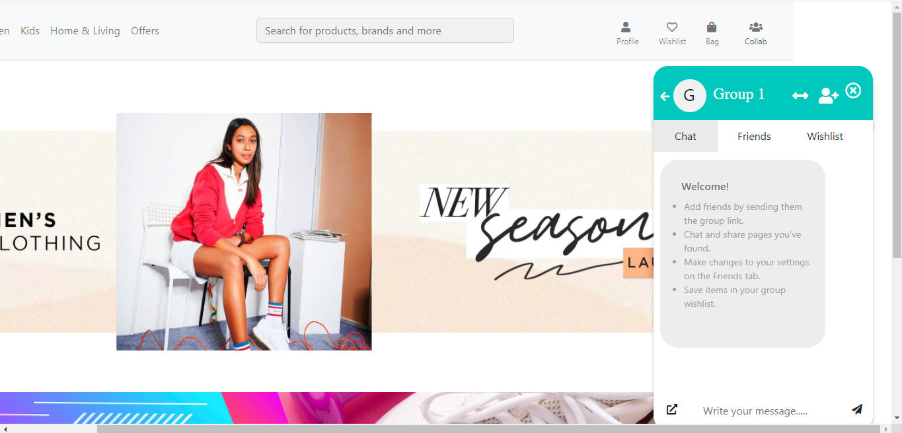
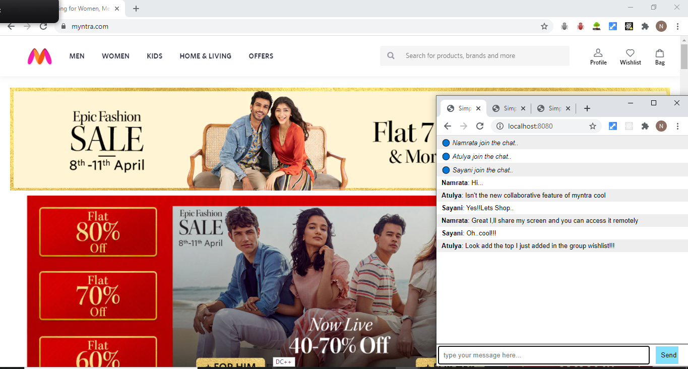
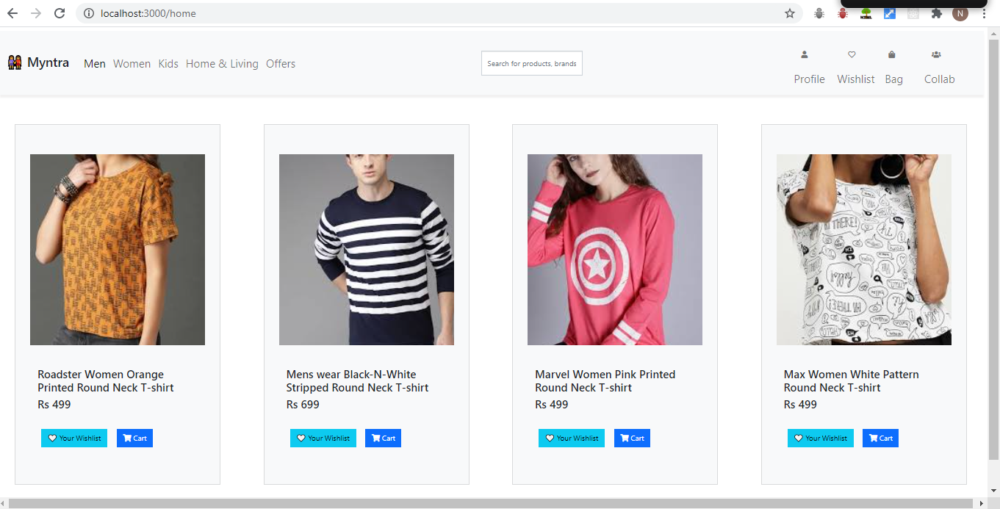
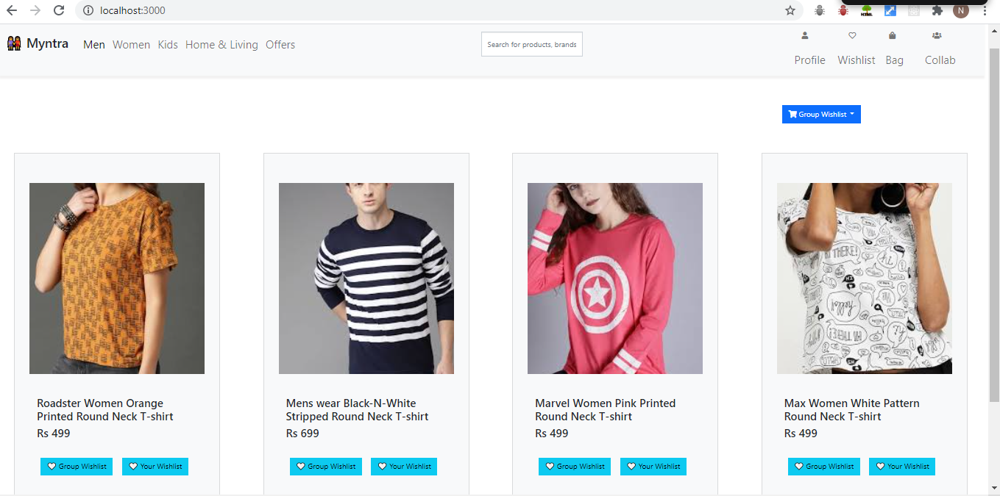
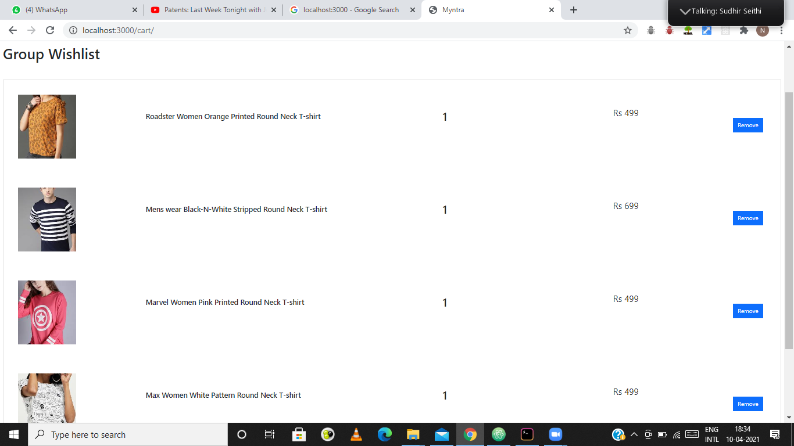
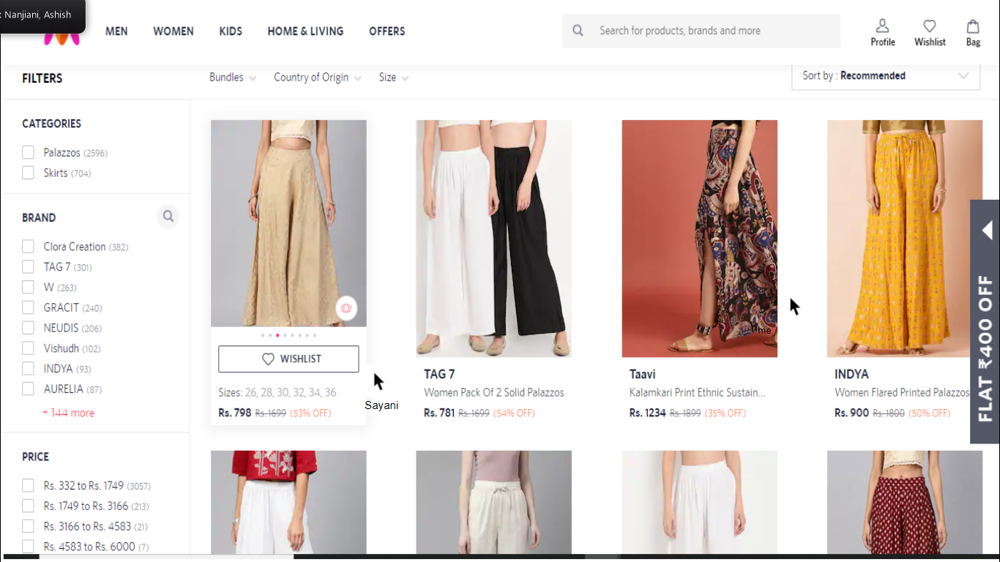

<!DOCTYPE html>
<html lang="en" dir="ltr">
  <head>
    <meta charset="utf-8">
  </head>
  <body>
    
The frontend protype of the implement Collaborative shopping interface would integrate the following component

    
    
The Collaborative Shopping interface can be roughly divided into the following components

    <ol>
      <li><b>Chat Interface:</b> Which allows friends to create a groupand chat with each other within the myntra interface without going back and forth</li>
      <li><b>Group Wishlist:</b> This allows a group of friends shopping collaboratively to create their shared Wishlist.</li>
      <li><b>Remote Screen Sharing:</b> This feature allows a user to share the screen and other memebers of the group to remotely access the users screen and hence shop together!!</li>
      </ol>
      
<b>Chat Interface</b>

        
      
<b>Group Wishlist Interface</b>

      
Tentetive homepage of the website

      
      
After selecting the collab option on the nav bar you can enter group and add items in shared wishlist

      
      
The wishlist item can be visualized as

        
      
<b>Remote Screen Sharing Interface</b>

      
Group members can remotely access screen which is being shared

        
      
Thankyou!! - From Team KleinSteins (Atulya Arya, Sayani Das, Namrata Chaudhari)

  </body>
</html>
